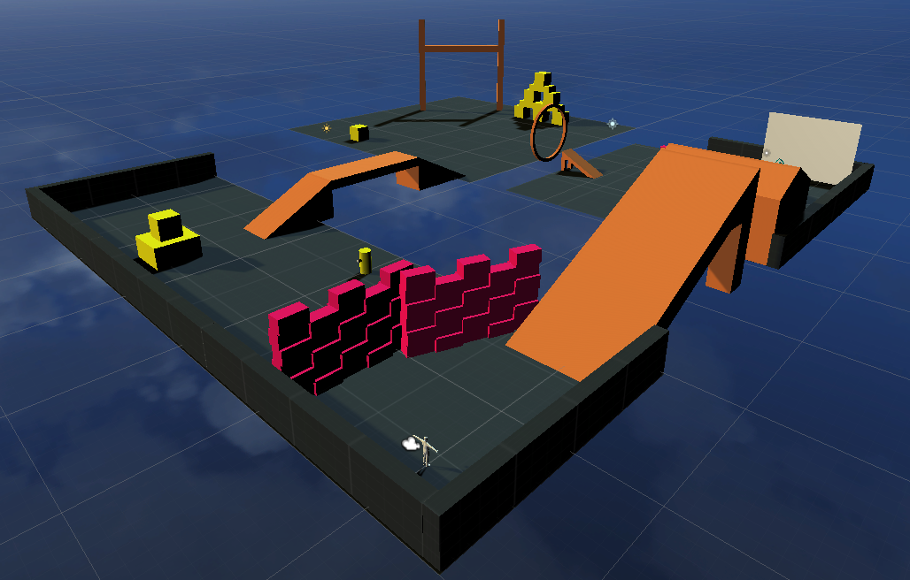

# ViPER: Virtual Reality Pose Estimator and Viewer

### Author Contact:
Edwin Pan <edwinpan@stanford.edu>

Manan Rai <mananrai@stanford.edu>

## Directory Structure
This outlines the most relevant files in this project. Note that all `.meta` files are not explicitely detailed.

    .
    ├── Packages                        # Project packages.
    ├── ProjectSettings                 # Project settings.
    ├── assets                          # All assets for the project reside here.
        ├── Cardboard                   # Assets for the Google Cardboard viewport.
        ├── Epic_BlueSunset             # Skybox assets.
        ├── Examples                    # Example assets from Unity Assert Store (1/4).
        ├── Models                      # Example assets from Unity Assert Store (2/4).
        ├── NavMeshComponents           # Enables AI mesh nagivation functionality.
        ├── SMPL                        # Assets relevant for the SMPL human mesh model.
        ├── SampleScenes                # Example assets from Unity Assert Store (3/4).
        ├── Scripts                     # All scripts for the project reside here.
            ├── CustomBullet.cs         # Script for grenade behavior.
            ├── EnemyAI.cs              # Script for enemy agent behavior.
            ├── PlayerWalk.cs           # Script for player motion behavior.
            └── ReadUSB.cs              # Script for getting orientation information from vrduino.
        ├── Standard Assets             # Example assets from Unity Assert Store (4/4).
        ├── raw mocap data              # All .fbx files used for animation reside here.
        ├── MyAnimation.controller      # Controls the state machine for player animations.
        └── VIPER.unity                 # Main entry point (RUN THIS).
    ├── docs                            # Figures and documents for this project.
    ├── vrduino                         # Scripts for reading data from the vrduino.
    └── README.md

## Running ViPER
To run ViPER, open `./assets/VIPER.unity` in Unity and either build the project or run it from within Unity. 

## Running Video-to-FBX 
This project evaluated 3D motions generated using the [VIBE](https://github.com/mkocabas/VIBE) pipeline. To generate the `.pkl` files and 2D projection videos, see their demo installation instructions. Once `.pkl` files are obtained from the target video, follow the instructions [here](https://github.com/mkocabas/VIBE#fbx-and-gltf-output-new-feature) to obtain a `.fbx` version of the inferred 3D motion. 

Note that this process requires installation of [blenderpy](https://pypi.org/project/bpy/). We found that installation on MacOS 11.4 does not currently work. However, the instructions for Windows 10 found [here](https://github.com/carlosedubarreto/vibe_win_install) worked as intended.

## Acknowledgement
This work was completed as a Final Project for *EE 267: Virtual Reality* at Stanford University. Some of the data used in this project was obtained from mocap.cs.cmu.edu, created with funding from NSF EIA-0196217.
